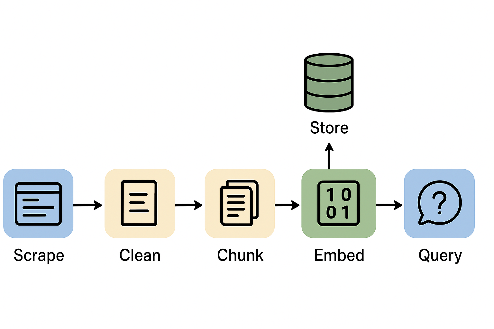

# Web Scraper and Q&A System with LLM Embeddings

A Python-based tool to scrape website content into **Markdown**, clean and chunk the text, embed it into a vector store, and answer questions using a **Large Language Model (LLM)** with different retrieval strategies.



---

## Features

- **Focused Web Scraping:**  
  Scrape only meaningful content (`<p>`, `<h1>`, `<h2>`, `<h3>`, `<code>`) while ignoring menus and sidebars.  

- **Interactive Link Selection:**  
  Decide which internal links to crawl during the scraping process.

- **Text Cleaning:**  
  Cleans scraped HTML into readable Markdown, removing extra spaces and blank lines.

- **Chunking for Embeddings:**  
  Splits large text into smaller chunks with overlaps for better LLM performance.

- **Embedding and Vector Storage:**  
  Uses HuggingFace embeddings and FAISS for storing and retrieving content.

- **Q&A with Multiple LLM Retrieval Strategies:**  
  Supports `stuff`, `map_reduce`, `refine`, and `map_rerank` chain types for flexible querying.

---

# 🔹 `chain_type` in RetrievalQA

RetrievalQA in LangChain supports different **chain types** for how retrieved documents are processed with the LLM.  

---

## 📌 1. `stuff`
- **Simplest method**  
- All retrieved documents are **stuffed (concatenated)** into the prompt along with your query.  
- Works well if:
  - Documents are short  
  - Number of tokens is small  

---

## 📌 2. `map_reduce`
- **Two-step process**:
  1. **Map step** → Each retrieved document is processed individually with the LLM.  
  2. **Reduce step** → Outputs are combined/summarized.  
- Better for handling:
  - Many documents  
  - Long documents  
- Helps avoid hitting token limits.  

---

## 📌 3. `refine`
- **Sequential refinement process**:  
  - Starts with the first document → generates an initial answer.  
  - Each subsequent document is used to **refine** the answer further.  
- Useful when you want the model to **incrementally improve** its response.  

---

## 📌 4. `map_rerank`
- Each document is:
  - Scored by the LLM for **relevance**  
  - An answer is produced per document  
- The **best-scored answer** is returned.  
- Useful when not all documents are relevant.  

---


## File Structure
```
├── scraper.py               # Main Python script
├── scraped_data.txt         # Cleaned Markdown output
├── requirements.txt         # packages to be installed
├── README.md
```
## 📦 Installation
Make sure you have **Python 3.9+** installed. Install dependencies:

```bash
pip install -r requirements.txt
```
