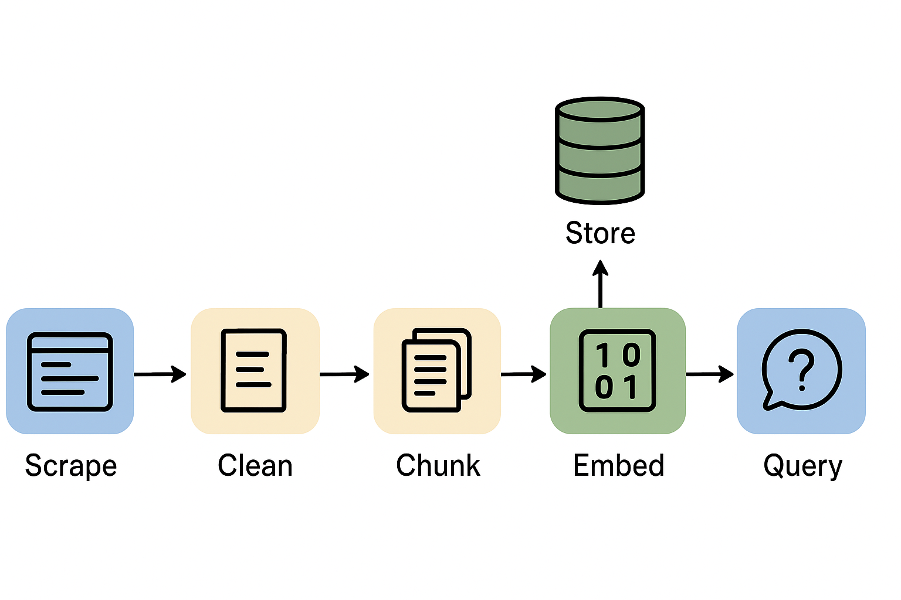

# Web Scraper and Q&A System with LLM Embeddings

A Python-based tool to scrape website content into **Markdown**, clean and chunk the text, embed it into a vector store, and answer questions using a **Large Language Model (LLM)** with different retrieval strategies.



---

## Features

- **Focused Web Scraping:**  
  Scrape only meaningful content (`<p>`, `<h1>`, `<h2>`, `<h3>`, `<code>`) while ignoring menus and sidebars.  

- **Interactive Link Selection:**  
  Decide which internal links to crawl during the scraping process.

- **Text Cleaning:**  
  Cleans scraped HTML into readable Markdown, removing extra spaces and blank lines.

- **Chunking for Embeddings:**  
  Splits large text into smaller chunks with overlaps for better LLM performance.

- **Embedding and Vector Storage:**  
  Uses HuggingFace embeddings and FAISS for storing and retrieving content.

- **Q&A with Multiple LLM Retrieval Strategies:**  
  Supports `stuff`, `map_reduce`, `refine`, and `map_rerank` chain types for flexible querying.

---

## File Structure
├── scraper.py               # Main Python script
├── scraped_data.txt         # Cleaned Markdown output
├── requirements.txt         # packages to be installed
├── README.md

## 📦 Installation
Make sure you have **Python 3.9+** installed. Install dependencies:

```bash
pip install -r requirements.txt
```
